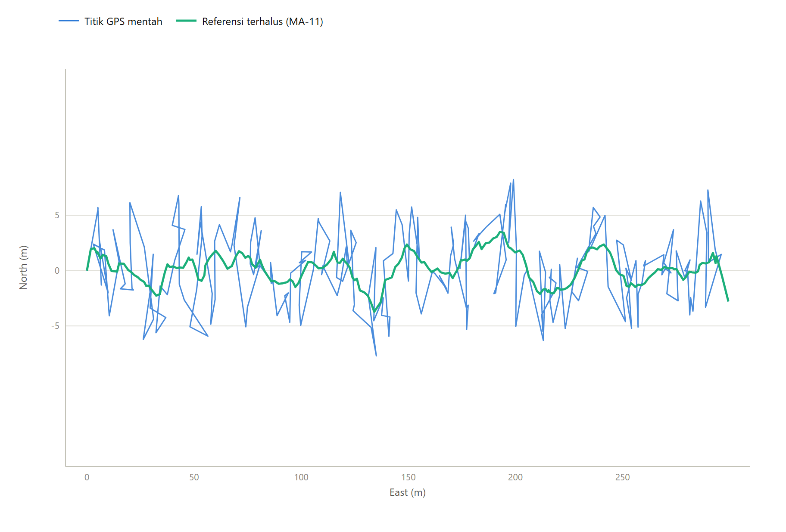
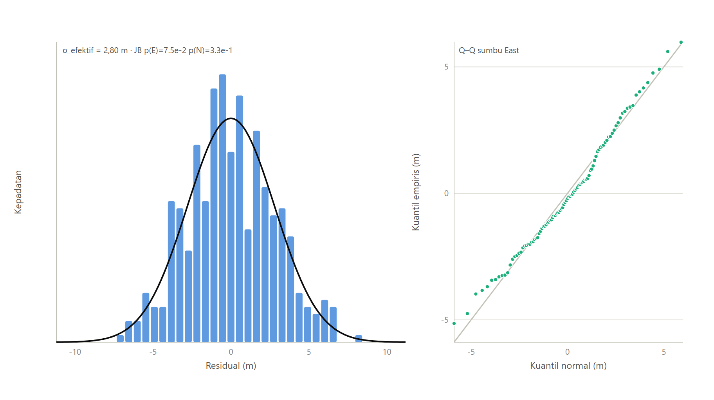
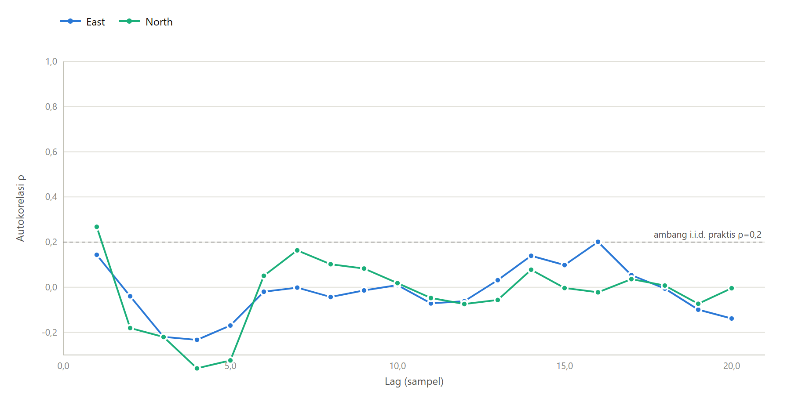
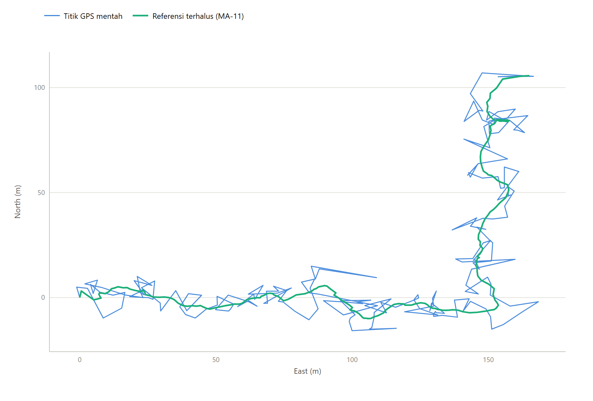
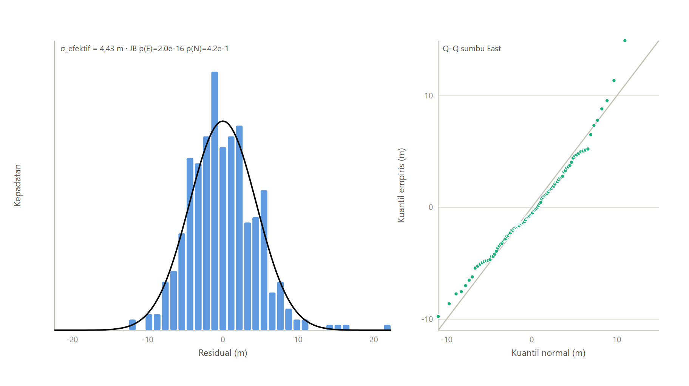
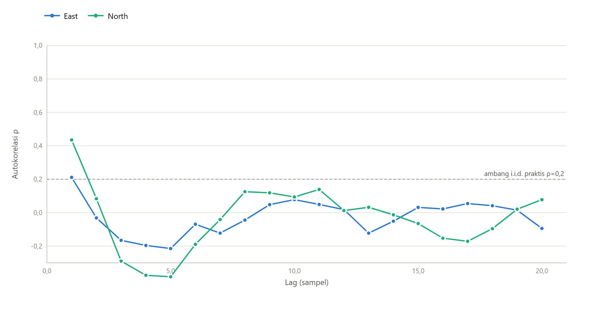
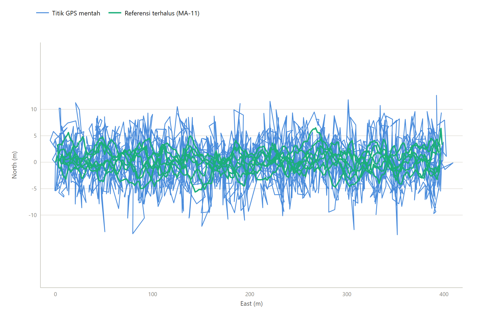
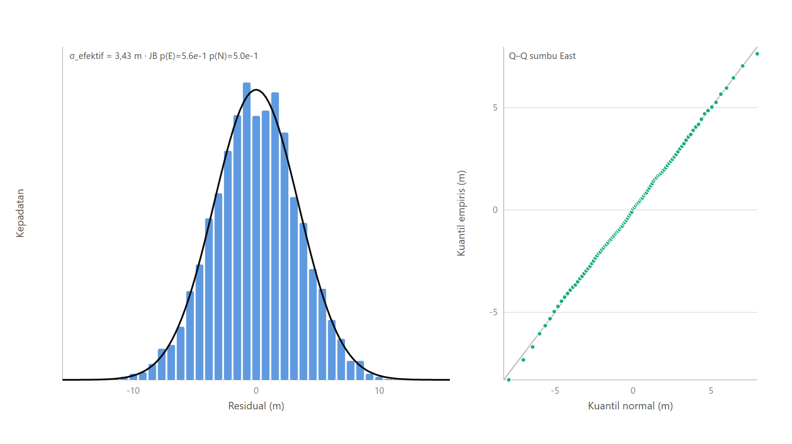
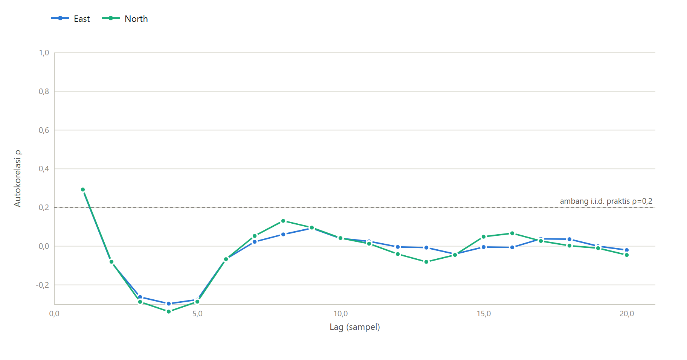

# Validasi Lapangan — Replay Trace GPS ke Algoritma Produksi

> ⚠️ **DATA DEMO SINTETIS.** Laporan ini dihasilkan dari fixture pembuktian pipeline,
> BUKAN dari rekaman GPS lapangan. **Dilarang mengutip angka laporan ini di naskah.**
> Rekam trace riil (lihat `field_logs/README.md`), lalu jalankan ulang `npm run replay`.

Trace diproses: 3. Algoritma dipanggil langsung dari modul produksi
`apps/mobile/src/services/sacred-zones-core.ts` (bukan salinan). Metodologi & asumsi
georeferensi ulang: `gps-replay/README.md`.

## Trace: `demo-a-lapangan-terbuka.gpx`

Titik: 214 | dibuang: 0 tak valid, 0 duplikat | loncatan waktu >10 dtk: 0 | akurasi pelaporan perangkat: tersedia (sumber: accuracy)

### Karakterisasi derau empiris

| Besaran | East | North |
|---|---|---|
| σ per sumbu (m) | 2,53 | 3,04 |
| Skewness | 0,390 | -0,064 |
| Kurtosis (excess) | -0,028 | -0,497 |
| Jarque–Bera (p) | 7.50e-2 | 3.27e-1 |
| ACF lag-1 ρ | 0,144 | 0,268 |
| Lag dekorrelasi (ρ<0,2) | 1 | 2 |

σ efektif (setara σ per-sumbu simulasi): **2,80 m** | rasio isotropi σE/σN: 0,83 | galat radial rata-rata: 3,56 m

**Vonis vs asumsi simulasi (Gaussian isotropik i.i.d.):** Konsisten dengan Gaussian isotropik i.i.d. pada taraf uji yang dipakai.

### Hasil replay vs prediksi simulasi (baris MC terdekat: σ = 3 m)

| Algoritma | Metrik | Lapangan (replay) | Simulasi (MC) |
|---|---|---|---|
| Geofence Miqat | Akurasi (%) | 97,44 | 99,92 |
| Geofence Miqat | F1 (%) | 97,31 | 99,91 |
| Deteksi Arafah | Akurasi (%) | 98,32 | 99,95 |
| Deteksi Arafah | F1 (%) | 98,32 | 99,96 |
| Tawaf | Putaran terdeteksi (truth 7) | 7 | rata-rata 7,00 |
| Sa'i | Leg terdeteksi (truth 1) | 1 | tepat-7: 100,00% |
| Jamarat | Benar (%) | 91,30 | 100,00 |
| Jamarat | Salah pilar (%) | 0,00 | 0,00 |
| Jamarat | Tak terdeteksi (%) | 8,70 | 0,00 |

- Sa'i: skala pemetaan s = 1,40 (leg aktual 299 m → koridor 419 m; derau ikut terskala).
- Tawaf: deret residual (68 sampel 3 dtk) lebih pendek dari 700 — diulang (tiling), pola berulang tercatat sebagai keterbatasan.
- Klasifikasi (miqat/arafah/jamarat): 25 penempatan deterministik melintasi batas; total sampel miqat 5350, arafah 5350, jamarat 1035.

### Gambar

## Trace: `demo-b-urban-canyon.gpx`

Titik: 208 | dibuang: 0 tak valid, 0 duplikat | loncatan waktu >10 dtk: 0 | akurasi pelaporan perangkat: tersedia (sumber: accuracy)

### Karakterisasi derau empiris

| Besaran | East | North |
|---|---|---|
| σ per sumbu (m) | 4,72 | 4,13 |
| Skewness | 0,867 | -0,036 |
| Kurtosis (excess) | 2,397 | -0,453 |
| Jarque–Bera (p) | 2.04e-16 | 4.21e-1 |
| ACF lag-1 ρ | 0,211 | 0,435 |
| Lag dekorrelasi (ρ<0,2) | 2 | 2 |

σ efektif (setara σ per-sumbu simulasi): **4,43 m** | rasio isotropi σE/σN: 1,14 | galat radial rata-rata: 5,47 m

**Vonis vs asumsi simulasi (Gaussian isotropik i.i.d.):** autokorelasi temporal signifikan (lag-1 rho E=0.21, N=0.44) — melanggar asumsi i.i.d.; non-normal menurut Jarque-Bera (p_E=2.0e-16, p_N=4.2e-1)

### Hasil replay vs prediksi simulasi (baris MC terdekat: σ = 5 m)

| Algoritma | Metrik | Lapangan (replay) | Simulasi (MC) |
|---|---|---|---|
| Geofence Miqat | Akurasi (%) | 97,38 | 99,81 |
| Geofence Miqat | F1 (%) | 97,49 | 99,76 |
| Deteksi Arafah | Akurasi (%) | 96,71 | 99,84 |
| Deteksi Arafah | F1 (%) | 96,71 | 99,86 |
| Tawaf | Putaran terdeteksi (truth 7) | 7 | rata-rata 7,00 |
| Sa'i | Leg terdeteksi (truth 1) | 1 | tepat-7: 100,00% |
| Jamarat | Benar (%) | 86,17 | 100,00 |
| Jamarat | Salah pilar (%) | 0,00 | 0,00 |
| Jamarat | Tak terdeteksi (%) | 13,83 | 0,00 |

- Sa'i: skala pemetaan s = 2,14 (leg aktual 196 m → koridor 419 m; derau ikut terskala).
- Tawaf: deret residual (66 sampel 3 dtk) lebih pendek dari 700 — diulang (tiling), pola berulang tercatat sebagai keterbatasan.
- Klasifikasi (miqat/arafah/jamarat): 25 penempatan deterministik melintasi batas; total sampel miqat 5200, arafah 5200, jamarat 1121.

### Gambar

## Trace: `demo-c-bolak-balik.gpx`

Titik: 2156 | dibuang: 0 tak valid, 0 duplikat | loncatan waktu >10 dtk: 0 | akurasi pelaporan perangkat: tersedia (sumber: accuracy)

### Karakterisasi derau empiris

| Besaran | East | North |
|---|---|---|
| σ per sumbu (m) | 3,42 | 3,44 |
| Skewness | -0,003 | -0,041 |
| Kurtosis (excess) | 0,114 | -0,095 |
| Jarque–Bera (p) | 5.60e-1 | 4.97e-1 |
| ACF lag-1 ρ | 0,290 | 0,293 |
| Lag dekorrelasi (ρ<0,2) | 2 | 2 |

σ efektif (setara σ per-sumbu simulasi): **3,43 m** | rasio isotropi σE/σN: 0,99 | galat radial rata-rata: 4,29 m

**Vonis vs asumsi simulasi (Gaussian isotropik i.i.d.):** Konsisten dengan Gaussian isotropik i.i.d. pada taraf uji yang dipakai.

### Hasil replay vs prediksi simulasi (baris MC terdekat: σ = 3 m)

| Algoritma | Metrik | Lapangan (replay) | Simulasi (MC) |
|---|---|---|---|
| Geofence Miqat | Akurasi (%) | 97,39 | 99,92 |
| Geofence Miqat | F1 (%) | 97,08 | 99,91 |
| Deteksi Arafah | Akurasi (%) | 98,54 | 99,95 |
| Deteksi Arafah | F1 (%) | 98,54 | 99,96 |
| Tawaf | Putaran terdeteksi (truth 7) | 7 | rata-rata 7,00 |
| Sa'i | Leg terdeteksi (truth 7) | 7 | tepat-7: 100,00% |
| Jamarat | Benar (%) | 94,16 | 100,00 |
| Jamarat | Salah pilar (%) | 0,06 | 0,00 |
| Jamarat | Tak terdeteksi (%) | 5,77 | 0,00 |

- Sa'i: skala pemetaan s = 1,05 (leg aktual 398 m → koridor 419 m; derau ikut terskala).
- Klasifikasi (miqat/arafah/jamarat): 25 penempatan deterministik melintasi batas; total sampel miqat 53900, arafah 53900, jamarat 7883.

### Gambar

---

## Interpretasi lintas-trace

Kolom "Simulasi (MC)" adalah prediksi model Gaussian i.i.d. pada σ efektif terdekat.
Selisih Lapangan vs Simulasi yang besar pada trace dengan autokorelasi/lonjakan tinggi
menunjukkan batas validitas model derau naskah — laporkan apa adanya di bab pembahasan/keterbatasan.

**Dua peringatan pembacaan (wajib dipahami sebelum membandingkan angka):**

1. **Kepadatan sampel berbeda.** Penempatan replay sengaja memusatkan seluruh titik pada
   pita sempit melintasi batas (±50 m; jamarat ±15 m), sedangkan simulasi MC menyebar titik
   merata di area jauh lebih luas. Akurasi replay karenanya SELALU lebih rendah dari MC pada
   σ yang sama — itu artefak desain penempatan, bukan bukti algoritma memburuk di lapangan.
   Bandingkan antar-trace replay (relatif), bukan replay vs MC secara absolut.
2. **σ efektif bisa terestimasi rendah pada derau berkorelasi kuat.** Komponen galat
   berfrekuensi rendah (autokorelasi tinggi, mis. multipath berkelanjutan) ikut terserap ke
   referensi terhalus sehingga tampak sebagai "jalur", bukan "derau". σ efektif dan ρ lag-1
   yang dilaporkan adalah batas bawah; lihat lag dekorrelasi untuk indikasi korelasi tersisa.

