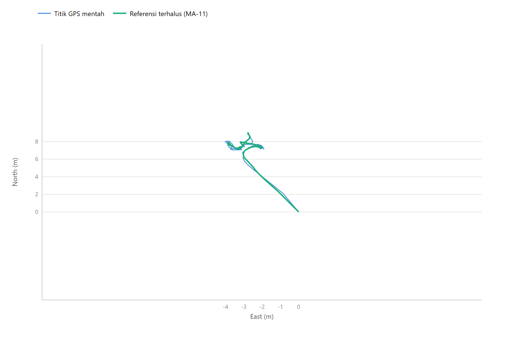
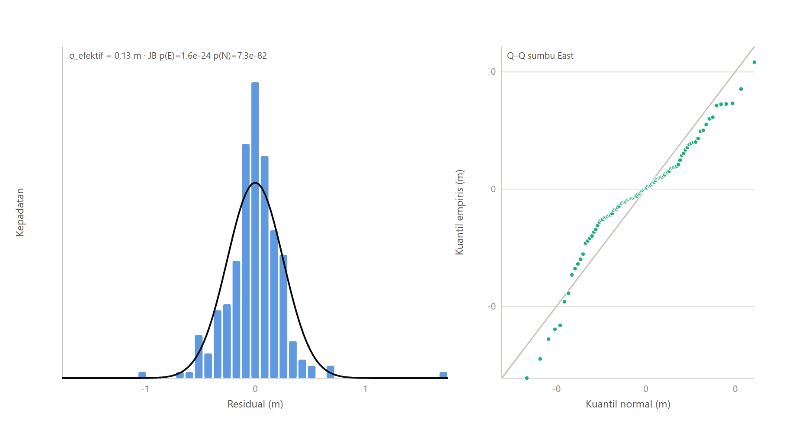
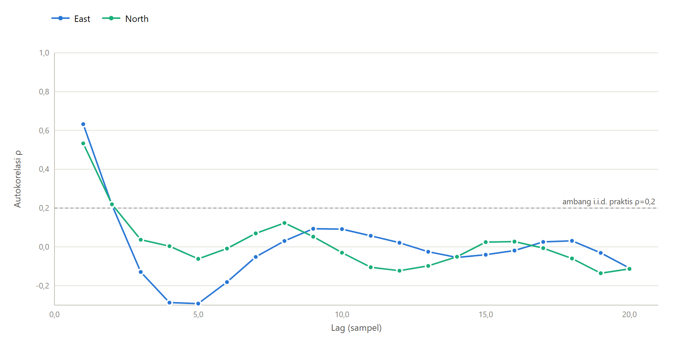

# Validasi Lapangan — Replay Trace GPS ke Algoritma Produksi

Trace diproses: 1. Algoritma dipanggil langsung dari modul produksi
`apps/mobile/src/services/sacred-zones-core.ts` (bukan salinan). Metodologi & asumsi
georeferensi ulang: `gps-replay/README.md`.

## Trace: `mabrur-a-lapangan-terbuka-2026-07-12.gpx`

Titik: 128 | dibuang: 0 tak valid, 0 duplikat | loncatan waktu >10 dtk: 0 | akurasi pelaporan perangkat: tersedia (sumber: accuracy)

Akurasi horizontal yang dilaporkan perangkat: rata-rata **4,8 m**, median 4,0 m, rentang 3,0–25,1 m. Bandingkan dengan σ empiris di bawah: selisih besar mengindikasikan keluaran GPS sudah dihaluskan penyedia lokasi (fused/Kalman) sehingga jitter antar-titik jauh lebih kecil daripada ketidakpastian posisi absolut.

### Karakterisasi derau empiris

| Besaran | East | North |
|---|---|---|
| σ per sumbu (m) | 0,11 | 0,14 |
| Skewness | -0,966 | 1,566 |
| Kurtosis (excess) | 4,309 | 8,136 |
| Jarque–Bera (p) | 1.55e-24 | 7.25e-82 |
| ACF lag-1 ρ | 0,633 | 0,534 |
| Lag dekorrelasi (ρ<0,2) | 3 | 3 |

σ efektif (setara σ per-sumbu simulasi): **0,13 m** | rasio isotropi σE/σN: 0,77 | galat radial rata-rata: 0,14 m

**Vonis vs asumsi simulasi (Gaussian isotropik i.i.d.):** autokorelasi temporal signifikan (lag-1 rho E=0.63, N=0.53) — melanggar asumsi i.i.d.; non-normal menurut Jarque-Bera (p_E=1.6e-24, p_N=7.3e-82)

### Hasil replay vs prediksi simulasi (baris MC terdekat: σ = 0 m)

| Algoritma | Metrik | Lapangan (replay) | Simulasi (MC) |
|---|---|---|---|
| Geofence Miqat | Akurasi (%) | 99,94 | 100,00 |
| Geofence Miqat | F1 (%) | 99,94 | 100,00 |
| Deteksi Arafah | Akurasi (%) | 99,91 | 100,00 |
| Deteksi Arafah | F1 (%) | 99,91 | 100,00 |
| Tawaf | Putaran terdeteksi (truth 7) | 7 | rata-rata 7,00 |
| Sa'i | Leg terdeteksi (truth 0) | 0 | tepat-7: 100,00% |
| Jamarat | Benar (%) | 100,00 | 100,00 |
| Jamarat | Salah pilar (%) | 0,00 | 0,00 |
| Jamarat | Tak terdeteksi (%) | 0,00 | 0,00 |

- Sa'i: trace bukan bolak-balik (leg < 50 m) — hasil 0/0 valid tapi tidak informatif.
- Tawaf: deret residual (39 sampel 3 dtk) lebih pendek dari 700 — diulang (tiling), pola berulang tercatat sebagai keterbatasan.
- Klasifikasi (miqat/arafah/jamarat): 25 penempatan deterministik melintasi batas; total sampel miqat 3200, arafah 3200, jamarat 3200.

### Gambar

---

## Interpretasi lintas-trace

Kolom "Simulasi (MC)" adalah prediksi model Gaussian i.i.d. pada σ efektif terdekat.
Selisih Lapangan vs Simulasi yang besar pada trace dengan autokorelasi/lonjakan tinggi
menunjukkan batas validitas model derau naskah — laporkan apa adanya di bab pembahasan/keterbatasan.

**Dua peringatan pembacaan (wajib dipahami sebelum membandingkan angka):**

1. **Kepadatan sampel berbeda.** Penempatan replay sengaja memusatkan seluruh titik pada
   pita sempit melintasi batas (±50 m; jamarat ±15 m), sedangkan simulasi MC menyebar titik
   merata di area jauh lebih luas. Akurasi replay karenanya SELALU lebih rendah dari MC pada
   σ yang sama — itu artefak desain penempatan, bukan bukti algoritma memburuk di lapangan.
   Bandingkan antar-trace replay (relatif), bukan replay vs MC secara absolut.
2. **σ efektif bisa terestimasi rendah pada derau berkorelasi kuat.** Komponen galat
   berfrekuensi rendah (autokorelasi tinggi, mis. multipath berkelanjutan) ikut terserap ke
   referensi terhalus sehingga tampak sebagai "jalur", bukan "derau". σ efektif dan ρ lag-1
   yang dilaporkan adalah batas bawah; lihat lag dekorrelasi untuk indikasi korelasi tersisa.

